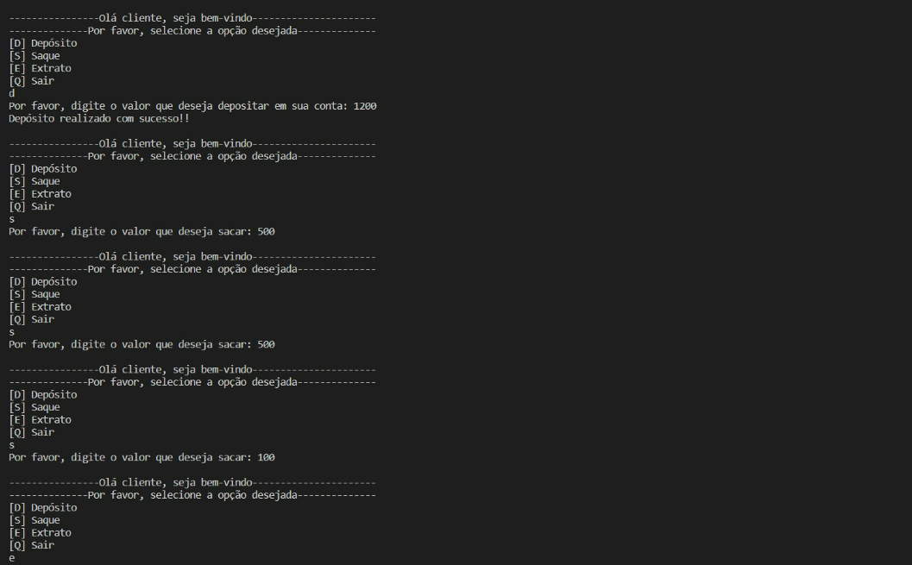
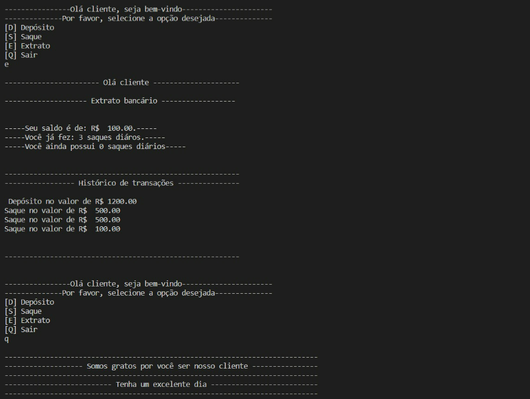
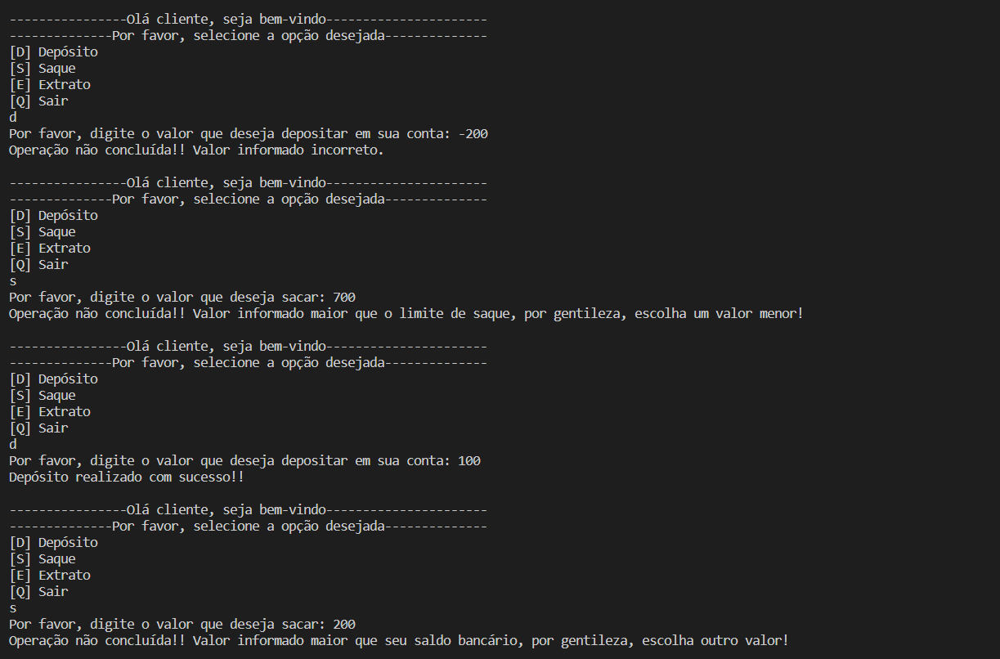

# Desafio de projeto: Criando um sistema bancário em Python

### Objetivos gerais

- Criar um sistema bancário com as operações:
- Depositar
- Sacar
- Visualizar extrato

### Desafio

Fomos contratados por um grande banco para desenvolver o seu novo sistema. Esse banco deseja modernizar suas escolhas e para isso escolheu a linguagem Python.
Para a primeira versão devemos implementar apenas 3 operações: depósito, saque e extrato.

### Operação de depósito

Deve ser possível depositar valores positivos para a minha conta bancária.
A v1 do projeto trabalha apenas com 1 usuário, dessa forma não precisamos nos preocupar em identificar qual é o número da agência e conta bancária.
Todos os depósitos devem ser armazenados em uma variável e exibidos na operação de extrato.

### Operação de saque

O sistema deve permitir realizar 3 saques diários com limite máximo de R$ 500,00 por saque.
Caso o usuário não tenha saldo em conta, o sistema deve exibir uma mensagem informando que não será possível sacar o dinheiro por falta de saldo.
Todos os saques devem ser armazenados em uma variável e exibidos na operação de extrato

### Operação de extrato

Essa operação deve listar todos os depósitos e saques realizados na conta.
No fim da listagem deve ser exibido o saldo atual da conta. Se o extrato estiver em branco, exibir a mensagem: Não foram realizadas movimentações.
Os valores devem ser exibidos utilizando o formato R$ xxx.XX, exemplo:
1500.45 = R$ 1500.45

### Tela funcional de depósito e saque

Na imagem abaixo, vemos que o usuário deposita um valor de 1200. E, logo em seguida, realiza três saques no valor de 500, 500 e 100, respectivamente.

### Tela funcional de extrato bancário

Na imagem abaixo, vemos que o usuário solicita o extrato bancário dos depósitos e saques realizados durante aquele dia.
No extrato é possível ver o seu saldo após os depósitos e saques feitos, quantos saques diários foram feitos, e quantos saques ainda restam para aquele dia.
Após o usuário desejar sair da interface do banco utilizando a tecla Q, recebe uma mensagem final de agradecimento.

### Operações não realizadas

Na imagem abaixo, caso o usuário tente por uma opção não mostrada no menu inicial

Na imagem abaixo, caso o usuário tente colocar um valor negativo em seu saldo, o sistema envia uma mensagem de operação não concluída.
Caso o usuário tente colocar um valor maior que o limite por saque, outra mensagem de operação não comcluída é enviado pelo sistema.
Se o usuário tentar colocar um valor maior que seu saldo bancário, o sistema pede que o mesmo informe um valor menor.

